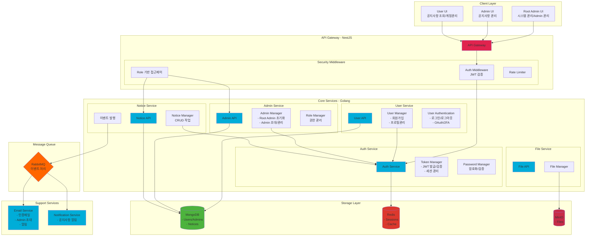

```mermaid
graph TB
    subgraph "Client Layer"
        RootAdminUI["Root Admin UI\n시스템 관리/Admin 관리"]
        AdminUI["Admin UI\n공지사항 관리"]
        UserUI["User UI\n공지사항 조회/계정관리"]
    end

    subgraph "API Gateway - NestJS"
        Gateway["API Gateway"]
        
        subgraph "Security Middleware"
            AuthMiddleware["Auth Middleware\nJWT 검증"]
            RoleMiddleware["Role 기반 접근제어"]
            RateLimiter["Rate Limiter"]
        end
    end

    subgraph "Core Services - Golang"
        subgraph "User Service"
            UserAPI["User API"]
            UserManager["User Manager\n- 회원가입\n- 프로필관리"]
            UserAuth["User Authentication\n- 로그인/로그아웃\n- OAuth/2FA"]
        end
        
        subgraph "Admin Service"
            AdminAPI["Admin API"]
            AdminManager["Admin Manager\n- Root Admin 초기화\n- Admin 초대/관리"]
            RoleManager["Role Manager\n권한 관리"]
        end
        
        subgraph "Auth Service"
            AuthAPI["Auth Service"]
            TokenManager["Token Manager\n- JWT 발급/검증\n- 세션 관리"]
            PasswordManager["Password Manager\n암호화/검증"]
        end

        subgraph "Notice Service"
            NoticeAPI["Notice API"]
            NoticeManager["Notice Manager\nCRUD 작업"]
            NoticeEvents["이벤트 발행"]
        end

        subgraph "File Service"
            FileAPI["File API"]
            FileManager["File Manager"]
        end
    end

    subgraph "Support Services"
        EmailService["Email Service\n- 인증메일\n- Admin 초대\n- 알림"]
        NotificationService["Notification Service\n- 공지사항 알림"]
    end

    subgraph "Storage Layer"
        MongoDB[("MongoDB\n- Users/Admins\n- Notices")]
        Redis[("Redis\n- Sessions\n- Cache")]
        MinIO[("MinIO\n- Files")]
    end

    subgraph "Message Queue"
        RabbitMQ{"RabbitMQ\n이벤트 처리"}
    end

    %% Client to Gateway
    RootAdminUI --> Gateway
    AdminUI --> Gateway
    UserUI --> Gateway

    %% Gateway to Services
    Gateway --> AuthMiddleware
    AuthMiddleware --> AuthAPI
    RoleMiddleware --> AdminAPI
    RoleMiddleware --> NoticeAPI

    %% Service Interactions
    UserManager --> AuthAPI
    AdminManager --> AuthAPI
    NoticeManager --> AuthAPI
    
    %% Event Flows
    NoticeEvents --> RabbitMQ
    RabbitMQ --> EmailService
    RabbitMQ --> NotificationService

    %% Storage Access
    UserAPI --> MongoDB
    AdminAPI --> MongoDB
    NoticeAPI --> MongoDB
    AuthAPI --> Redis
    FileManager --> MinIO

    style Gateway fill:#E0234E
    style UserAPI fill:#00ADD8
    style AdminAPI fill:#00ADD8
    style AuthAPI fill:#00ADD8
    style NoticeAPI fill:#00ADD8
    style FileAPI fill:#00ADD8
    style EmailService fill:#00ADD8
    style NotificationService fill:#00ADD8
    style MongoDB fill:#4DB33D
    style Redis fill:#DC382D
    style MinIO fill:#C72C48
    style RabbitMQ fill:#FF6600
```